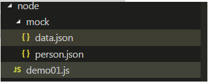
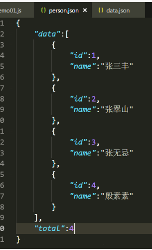
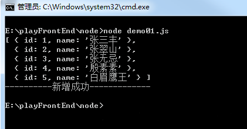
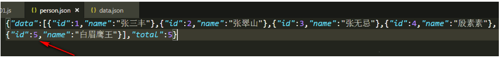
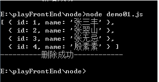
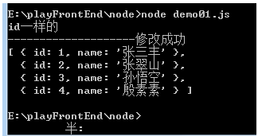
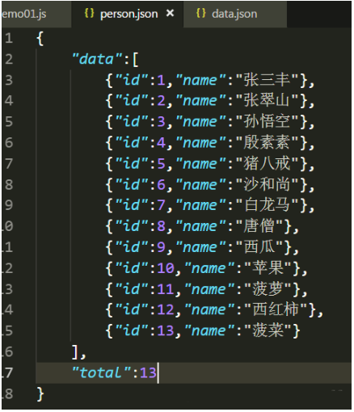
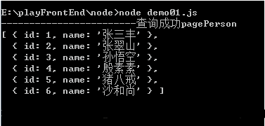
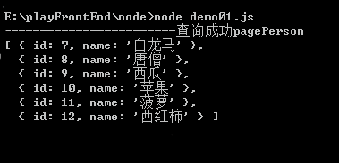

### 利用nodejs对本地json文件进行增删改查
>nodejs的文件系统，接触过node的对node的文件系统肯定不会陌生，这两天我就在思考一个问题，我是否可以在本地操作我的本地json文件，这样一个本地的文本数据库就有了，如果是便签之类，记录的软件，我完全可以不用连后台的数据库，我可以自己操作本地的json文件，自己用node写后台，答案是肯定的，下面我们就一起来实现一下吧，对本地json文件的增、删、改、查
#### 1.增
首先我们先看一下demo的目录结构



我们看一下person.json的内容



下面写nodejs的代码
```js
var fs = require('fs');
var params = {
    "id":5,
    "name":"白眉鹰王"
}//在真实的开发中id肯定是随机生成的而且不会重复的，下一篇写如何生成随机切不会重复的随机数，现在就模拟一下假数据
//写入json文件选项
function writeJson(params){
    //现将json文件读出来
    fs.readFile('./mock/person.json',function(err,data){
        if(err){
            return console.error(err);
        }
        var person = data.toString();//将二进制的数据转换为字符串
        person = JSON.parse(person);//将字符串转换为json对象
        person.data.push(params);//将传来的对象push进数组对象中
        person.total = person.data.length;//定义一下总条数，为以后的分页打基础
        console.log(person.data);
        var str = JSON.stringify(person);//因为nodejs的写入文件只认识字符串或者二进制数，所以把json对象转换成字符串重新写入json文件中
        fs.writeFile('./mock/person.json',str,function(err){
            if(err){
                console.error(err);
            }
            console.log('----------新增成功-------------');
        })
    })
}
writeJson(params)//执行一下;
```
结果如下:



下面我们来看一下json文件的结果



json文件已经被新增进来了
#### 2.删
```js
var fs = require('fs');
//删除json文件中的选项
function deleteJson(id){
    fs.readFile('./mock/person.json',function(err,data){
        if(err){
            return console.error(err);
        }
        var person = data.toString();
        person = JSON.parse(person);
        //把数据读出来删除
        for(var i = 0; i < person.data.length;i++){
            if(id == person.data[i].id){
                //console.log(person.data[i])
                person.data.splice(i,1);
            }
        }
        console.log(person.data);
        person.total = person.data.length;
        var str = JSON.stringify(person);
        //然后再把数据写进去
        fs.writeFile('./mock/person.json',str,function(err){
            if(err){
                console.error(err);
            }
            console.log("----------删除成功------------");
        })
    })
}
deleteJson(5);//执行一下
```

第5个就删除了

#### 3.改
```js
var fs = require('fs');
var params = {
    "name":"孙悟空"
}
function changeJson(id,params){
    fs.readFile('./mock/person.json',function(err,data){
        if(err){
            console.error(err);
        }
        var person = data.toString();
        person = JSON.parse(person);
        //把数据读出来,然后进行修改
        for(var i = 0; i < person.data.length;i++){
            if(id == person.data[i].id){
                console.log('id一样的');
                for(var key in params){
                    if(person.data[i][key]){
                        person.data[i][key] = params[key];
                    }
                }
            }
        }
        person.total = person.data.length;
        var str = JSON.stringify(person);
        //console.log(str);
        fs.writeFile('./mock/person.json',str,function(err){
            if(err){
                console.error(err);
            }
            console.log('--------------------修改成功');
            console.log(person.data);
        })
    })
}
changeJson(3,params)//执行一下;
```
结果如下:


#### 4.查
现在模拟一下分页先看一下json文件长什么样


```js
var fs = require('fs');
//通过传回来的页数，进行分页模拟
function pagination(p,s){
    //p为页数，比如第一页传0，第二页传1,s为每页多少条数据
    fs.readFile('./mock/person.json',function(err,data){
        if(err){
            console.error(err);
        }
        var person = data.toString();
        person = JSON.parse(person);
        //把数据读出来
        //console.log(person.data);
        var length = person.data.length;
        var pagePerson = person.data.slice(s*p,(p+1)*s);
        console.log('------------------------查询成功pagePerson');
        console.log(pagePerson);
    })
}
pagination(0,6);//查询第一页，每页的数据条数为6条
```
执行结果为



下面看一下第二页执行pagination(1,6);执为

