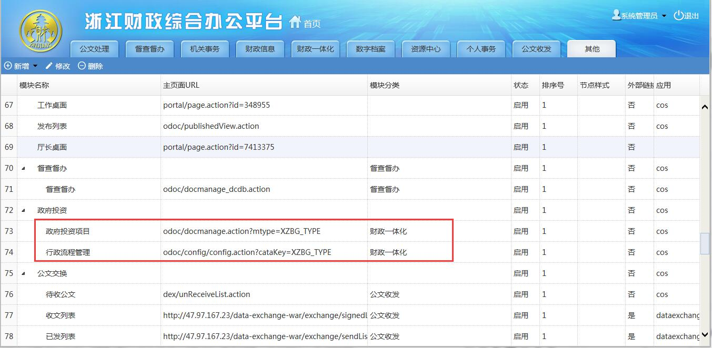
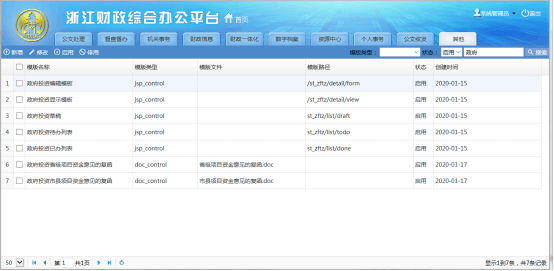
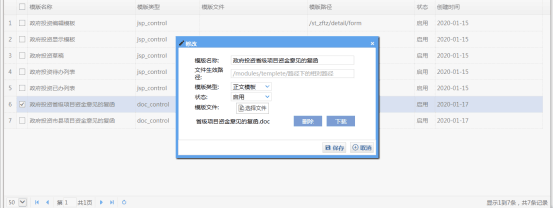

## 省厅政府投资项目

> 项目背景: 根据新修订的《浙江省政府投资预算管理办法》（浙江省人民政府令第363号）和《浙江省预算审查监督条例》（浙江省人民代表大会常务委员会公告第50号）规定，为强化省厅对政府投资项目的财政管理，规范厅内审核工作流程，明确审核职责分工，提高财政管理工作的协调性和有效性

## 1.政府投资流程配置
#### 1.1 菜单配置
- 科目键（XZBG_TYPE）
 
- 功能模块:菜单配置

政府投资项目：odoc/docmanage.action?mtype=XZBG_TYPE
政府投资流程配置：odoc/config/config.action?cataKey=XZBG_TYPE
效果：
 
配置：
 

#### 1.2 模板配置(模板管理)
- 编辑模板：/st_zftz/detail/form
- 查看模板：/st_zftz/detail/view
- 待办列表：st_zftz/list/todo
- 已办列表：st_zftz/list/done
- 省级，县级复函模板自行上传
 
复函模板：
 

#### 1.3 数据字典配置
政府级次：odoc_zftz_project_level （省级/市县）
项目阶段：odoc_zftz_project_stage (可行性研究/概算/概算调整/竣工财务结算)
流程状态：odoc_zftz_project_finish 

