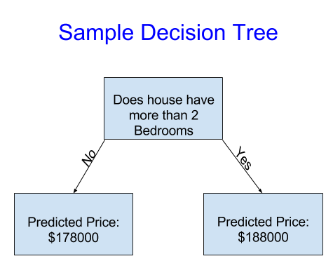
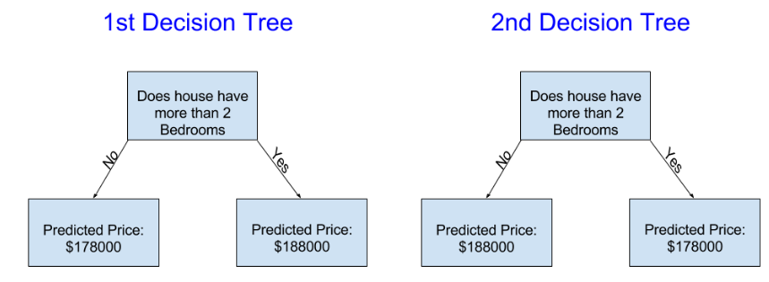
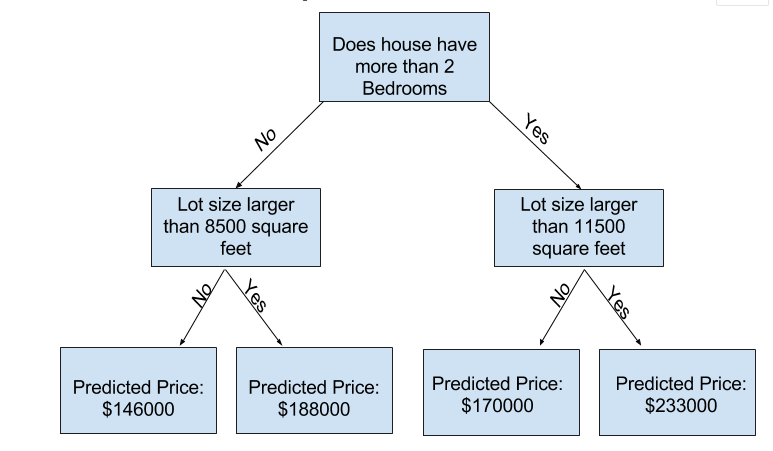
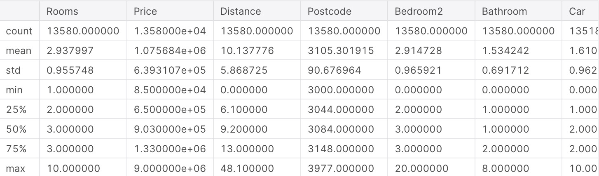
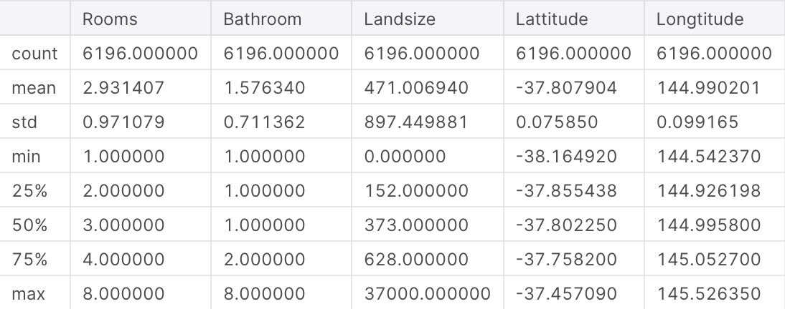
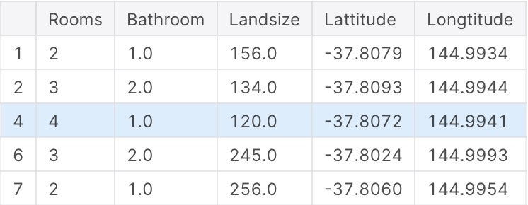
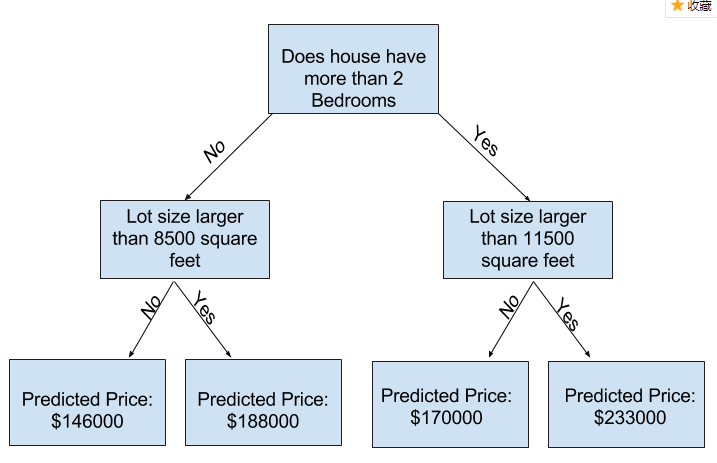
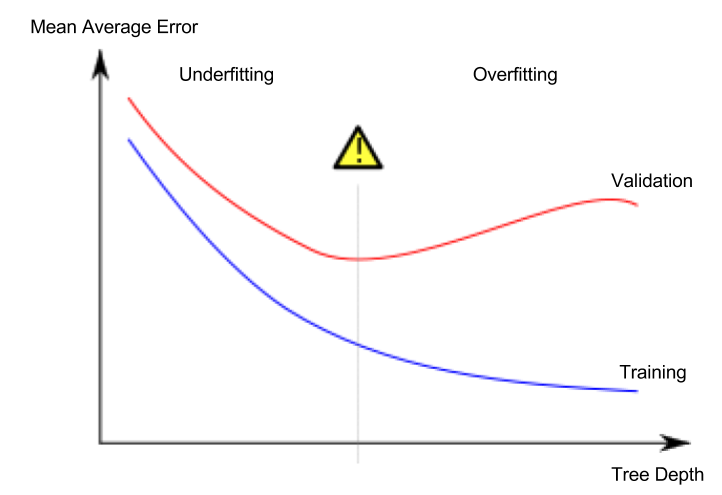

本课程是机器学习的入门课程，公有6章（3小时可以学完）。里面的代码全部使用python语言，最好是有点python基础。本文只是翻译，可以在kaggle上看到该课程原文[Intro to Machine Learning](https://www.kaggle.com/learn/intro-to-machine-learning)，之后会陆续翻译一些进阶课程。

# 1、模型是如何工作的

## 介绍
我们首先概述模型的工作原理和模型的使用。之前做过统计模型或者机器学习的人可能会感到很基础，别担心，我们很快就会建立强大的模型。

本课程将为以下场景建模

你的表哥做房地产赚了几百万美元，由于你对数据科学有一定研究，因此他想与你合作，他提供资金，你提供模型来预测房子的价值。

你问你的表哥他过去是怎么预测价格的，他说他靠直觉，通过了解你渐渐发现他通过过去所见确定了价格的模式，然后使用这些模式应用到新房子的预测上。

机器学习就是类似这种方式，我们将开始一个叫决策树(Decision Tree)的模型，虽然现在存在着更复杂的模型能让预测结果更精确，但是决策树更容易让人理解，它是最好的模型的基础。

为了简单，我们从最简单的可能决策树开始



它将房子分为2类，房子在同一分类下的历史平均价格就是预测价格。

我们使用数据将房子分为2个组，然后决定每组房子的预测价格，从数据中捕获模式的这一步称为拟合(fitting)或者训练(training)模型，这些数据称为训练数据(training data)。

模型拟合详情非常复杂，我们留在之后说。在模型拟合之后，你能在新的数据中使用它来预测新的房子。

## 改进决策树
下面的的决策树哪一个更可能来自于真实的房地产训练数据的结果？



左边的决策树可能满足更多的场景，因为真实情况就是卧室多的房子比卧室少的房子贵，这个模型最大的缺点就是没有考虑更多影响房子价格的因素，像浴室数量、面积、地段等。

你能使用更多“分支”的树来捕获更多的要素，这些也称为“深度树”，一个包含总面积的决策树可能看起来像这样：



你通过决策树的训练来预测房子的价格，总是会选择与房子特征相似的路径，树的底部就是房子的预测价格，这个底部被称为叶子节点(leaf)。

数据决定了叶子的分类和值，所以是时候去检查你的工作数据了。


# 2、基处数据的探索

## 使用Pandas来熟悉数据

所有机器学习的第一步都是熟悉数据，你将会用到Pandas类库，Pandas是数据科学家使用的初级工具来探索和操作数据。大多数的人在在代码中使用缩写pd,就像下面这样
```
import pandas as pd
```
Pandas是数据表中最重要的类库，数据表保存你可能认为是表的苏剧类型，类似于Excel的sheet或SQL数据库中的表。

Pandas提供了强大的方法让你处理这种类型的数据。

作为一个例子，我们将看看澳大利亚墨尔本的房价数据。在实践练习中，您将应用相同的过程到爱荷华州的房价数据中。

这个例子（墨尔本）数据的路径是../input/melbourne-housing-snapshot/melb_data.csv

我们将用以下的命令导入和探索数据(上面的是输入，下面的是输出):
```
# save filepath to variable for easier access
melbourne_file_path = '../input/melbourne-housing-snapshot/melb_data.csv'
# read the data and store data in DataFrame titled melbourne_data
melbourne_data = pd.read_csv(melbourne_file_path) 
# print a summary of the data in Melbourne data
melbourne_data.describe()
```


## 数据描述解释

这个原始数据的结果集每一列显示来8个数字，第一个数字count,显示来非空的值的数量。

空值由很多原因产生，例如只有一个卧室的房子就不会收集次卧的数量，我们之后会再来讨论空值的问题。

第二个值是mean，也就是平均值，在这种情况下，std指的是标准差，用来衡量数值的分布情况。

min, 25%, 50%, 75% 和 max 指的是，想象给每一列从低到高排序，第一个（最小）值就是min,如果到1/4处就是25% 值，同理 50%和75%一样，max指的是最大值。


# 3、第一个机器学习模型

## 选择模型数据

你的数据集变量太多了，即使打印出来很好看，也会让你头疼，你怎么将大量数据缩简到你能理解的程度呢？

我们将使用我们的直觉挑选出一些变量，后面的课程将用统计学技术自动排序变量。

为了选择变量（列），我们需要观察数据集的所有列，使用到数据表的列属性（代码如下）。
```
import pandas as pd

melbourne_file_path = '../input/melbourne-housing-snapshot/melb_data.csv'
melbourne_data = pd.read_csv(melbourne_file_path) 
melbourne_data.columns
```
```
Index(['Suburb', 'Address', 'Rooms', 'Type', 'Price', 'Method', 'SellerG',
       'Date', 'Distance', 'Postcode', 'Bedroom2', 'Bathroom', 'Car',
       'Landsize', 'BuildingArea', 'YearBuilt', 'CouncilArea', 'Lattitude',
       'Longtitude', 'Regionname', 'Propertycount'],
      dtype='object')
```
```
# The Melbourne data has some missing values (some houses for which some variables weren't recorded.)
# We'll learn to handle missing values in a later tutorial.  
# Your Iowa data doesn't have missing values in the columns you use. 
# So we will take the simplest option for now, and drop houses from our data. 
# Don't worry about this much for now, though the code is:

# dropna drops missing values (think of na as "not available")
melbourne_data = melbourne_data.dropna(axis=0)
```

这里由很多方法去选择数据集，可以从[Pandas Micro-Course](https://www.kaggle.com/learn/pandas)中更深入的了解这些，但是现在我们主要关注以下2点：
- 1、点符号，用来选择“预测目标”
- 2、使用列列表来选择，我们使用它来选择“特性”

## 选择预测目标

你能用**点**取出变量，这一列被存储在一个系列（**Series**）中，看起来就像数据表中的单列。

我们使用点去选择想要预测的列，也称为**预测目标**，按照惯例，预测目标被称为**y**，所以我们在墨尔本的数据中保存房价的代码是
```
y = melbourne_data.Price
```

## 选择“特性”

输入到模型中的列（之后会用作预测）被称为“特性”，在当前情况下，这些列将会决定房价，有时你将会使用除目标外的所有列作为特性，有时特性越少越好。

现在，我们将建立只有少量特性的模型，之后你将知道如何迭代和比较不同特性的模型。

我们通过括号内提供的列名来选择多个特性，列表中的每一项都是字符串（带引号）

例如：
```
melbourne_features = ['Rooms', 'Bathroom', 'Landsize', 'Lattitude', 'Longtitude']
```
通常，这个数据称为**X**。
```
X = melbourne_data[melbourne_features]
```

快速查看数据使用**describe**方法，显示前几条记录使用**head**方法
```
X.describe()
```

```
X.head()
```


通过这些命令在视觉上检查数据是科学家工作的重要一部分，在未来的数据集检查中你将会频繁的找到惊喜。


## 建立模型

你将使用**scikit-learn**类库来创建你的模型，正如你在事例代码中看到的那样，编码时这个类库被写为**sklearn**，在通过数据表建立数据类型的模型上，Scikit-learn是最流行的类库。

建立并使用一个模型的步骤如下：
- **定义（Define）**：模型的类型是什么？使用什么决策树？是否是一些其他类型的模型？是否指定模型类型的一些其他参数。
- **拟合（Fit）**：从提供的数据中选择参数，这是建模的核心。
- **预测（Predict）**：就是字面意思。
- **评估（Evaluate）**：决定模型预测的准确性。

下面是用scikit-learn类库定义一个决策树并拟合特性和目标变量的简单例子。
```
from sklearn.tree import DecisionTreeRegressor

# Define model. Specify a number for random_state to ensure same results each run
melbourne_model = DecisionTreeRegressor(random_state=1)

# Fit model
melbourne_model.fit(X, y)
```
```
DecisionTreeRegressor(criterion='mse', max_depth=None, max_features=None,
                      max_leaf_nodes=None, min_impurity_decrease=0.0,
                      min_impurity_split=None, min_samples_leaf=1,
                      min_samples_split=2, min_weight_fraction_leaf=0.0,
                      presort=False, random_state=1, splitter='best')
```
很多机器学习模型在训练模型时都允许有一些随机性，为**random_state**参数指定一个特别的数字可以确保每次每次运行都能得到相同的结果。使用随机的数字是一个很好的实践，但并不会影响模型的质量

拟合模型之后，我们现在可以做预测了。

实践中，我们不是预测已经定价的房子，而是预测将上市的房子。但是我们会先预测少量的训练数据来观察模型的质量。
```
print("Making predictions for the following 5 houses:")
print(X.head())
print("The predictions are")
print(melbourne_model.predict(X.head()))
```
```
Making predictions for the following 5 houses:
   Rooms  Bathroom  Landsize  Lattitude  Longtitude
1      2       1.0     156.0   -37.8079    144.9934
2      3       2.0     134.0   -37.8093    144.9944
4      4       1.0     120.0   -37.8072    144.9941
6      3       2.0     245.0   -37.8024    144.9993
7      2       1.0     256.0   -37.8060    144.9954
The predictions are
[1035000. 1465000. 1600000. 1876000. 1636000.]
```

# 4、模型验证

我们建了一个模型，但有多好？

在这个课程中，你讲会使用模型验证来评估模型质量，计算模型质量是迭代的改善模型的关键。

## 什么是模型验证

你想评价你建立的所有模型，大多数应用都是通过预测精度来评估模型，换句话说，就是评估预测结果是否接近实际值。

很多人在评估模型精度的时候犯了一个很大的错误，他们通过训练数据进行预测，并将这些预测值于训练数据中的目标值进行比较。你将看到这个方法的问题并且学习如何在一瞬间解决它，让我们想想第一步应该怎样做。

首先需要以一种可以让人理解的方式来总结模型的质量，如果你比较10000个房子的预测值和实际值，你很可能会发现预测结果有好有坏，对10000个房子都做预测将是无意义的，需要将它总结成单个指标。

存在很多总结模型质量的指标，但是我们将以**Mean Absolute Error（MAE，平均绝对误差）**指标开始，我们从最后一个词来分析这个指标，error（误差）。

每一个房子的预测误差是：
```
error=actual−predicted
```
因此，如果一个房子实际价格是 $150,000，你的预测值是$100,000，这个误差就是$50,000。
对于MAE度量。我们取每个误差的绝对值，这一步会将误差转为正数，然后取所有绝对误差的平均值。这就是模型质量的度量，用英语简单的说就是：
> On average, our predictions are off by about X.

为了计算MAE，首先需要一个模型，如下：
```
# Data Loading Code Hidden Here
import pandas as pd

# Load data
melbourne_file_path = '../input/melbourne-housing-snapshot/melb_data.csv'
melbourne_data = pd.read_csv(melbourne_file_path) 
# Filter rows with missing price values
filtered_melbourne_data = melbourne_data.dropna(axis=0)
# Choose target and features
y = filtered_melbourne_data.Price
melbourne_features = ['Rooms', 'Bathroom', 'Landsize', 'BuildingArea', 
                        'YearBuilt', 'Lattitude', 'Longtitude']
X = filtered_melbourne_data[melbourne_features]

from sklearn.tree import DecisionTreeRegressor
# Define model
melbourne_model = DecisionTreeRegressor()
# Fit model
melbourne_model.fit(X, y)
```
```
DecisionTreeRegressor(criterion='mse', max_depth=None, max_features=None,
                      max_leaf_nodes=None, min_impurity_decrease=0.0,
                      min_impurity_split=None, min_samples_leaf=1,
                      min_samples_split=2, min_weight_fraction_leaf=0.0,
                      presort=False, random_state=None, splitter='best')
```

建立模型之后，我们需要计算平均绝对误差：
```
from sklearn.metrics import mean_absolute_error

predicted_home_prices = melbourne_model.predict(X)
mean_absolute_error(y, predicted_home_prices)
```
```
434.71594577146544
```

## “样本内”分数的问题

上面计算的结果称为“样本内”分数，我们建立和评估模型都使用同一个样本，这就是它不好的原因。

想象一下，在大型房地产市场，门的颜色和房子的价格无关。

然而，你建模使用的样本数据中，绿色门的房子都很贵，模型就会按照这种模式预测房价，所以对绿色门的房子总是会预测一个高的价格。

由于模型的实际价值是用来预测新的数据，我们通过未用来构建模型的数据来衡量性能，最直接的方式就是从模型建造程序中排除一些数据，然后使用这部分从未出现的数据来测试模型的准确性，这部分数据称为**验证数据（validation data）**。

## 编码

scikit-learn类库中有一个**train_test_split**方法将数据分为2部分，我们将使用一些数据作为训练数据来拟合模型，另一些数据作为验证数据来计算**mean_absolute_error**。

下面是代码：
```
from sklearn.model_selection import train_test_split

# split data into training and validation data, for both features and target
# The split is based on a random number generator. Supplying a numeric value to
# the random_state argument guarantees we get the same split every time we
# run this script.
train_X, val_X, train_y, val_y = train_test_split(X, y, random_state = 0)
# Define model
melbourne_model = DecisionTreeRegressor()
# Fit model
melbourne_model.fit(train_X, train_y)

# get predicted prices on validation data
val_predictions = melbourne_model.predict(val_X)
print(mean_absolute_error(val_y, val_predictions))
```
```
259556.7211103938
```

## Wow!

你样本内的平均绝对误差大约是500美元，样本外的却超过了250,000美元。

这就是一个几乎完全准确的模型和在实际情况中几乎不可用例子，作为参考，验证数据中的平均房价是$1,100,000,所以新数据的误差大约是平均房价的1/4。

有很多改善模型的方法，例如通过实验找到更好的特性或者不同的模型类型。


# 5、欠拟合与过拟合

在最后一步，你将理解欠拟合和过拟合的概念，你将会应用这些知识使模型更加精确。

## 用不同的模型实验

现在你有一种可靠的方式衡量模型的精度，你能用不同的模型实验来看哪个模型能产生最好的预测，但是你会选择什么模型呢？

你能看scikit-learn类库的[文档](http://scikit-learn.org/stable/modules/generated/sklearn.tree.DecisionTreeRegressor.html),决策树模型有很多功能（超出你想要的或者需要很长时间学习），最重要的功能是决定树的深度，回想第一章，一棵树的深度是它在预测之前分裂多少次的量度，这是一颗比较浅的树



实际上，一棵树从顶端（所有房子）到叶子之间有10个分裂并不罕见，树越深，数据集被切割成树叶，房子也越来越少。如果一颗树只有一个分裂，数据将会分成2个分组，如果每个组再次分裂，我们将得到4个组，再次分裂将会得到8个分组，如果我们保持在每个等级上增加更多的分裂来将分组增加一倍，10次之后我们将有2^10个房子分组，也就是1024片叶子。

一个模型完美匹配测试数据但在验证其他新数据效果很差的现象称为**过拟合（overfitting）**，另一方面，如果我们让树非常浅，将不能清晰的区分房子分组。

极端情况下，如果树将房子只分为2或4个分组，每一组仍然有很多类型的房子，甚至是在测试数据中大多数房子的预测结果也可能差别很大（同样的原因，验证结果也很糟糕），当一个模型不能在数据中找到重要的区分和模式时，测试数据的表现也会很差，这就是**欠拟合（underfitting）**。

由于我们关心的是预测新数据的精度，我们根据验证数据进行估计，我们想在欠拟合和过拟合之间找到最佳的位置，如图，我们想要验证曲线（红色）的最低点



## 一个例子

有几种方法可以控制数的深度，许多都是允许一些树的路径深与其他树的路径，最大的叶子节点参数提供了一种非常敏感的方式来控制欠拟合和过拟合，我门允许模型产生的叶片越多，我门从图上的欠拟合区域详过拟合区域移动的就越多。

我们能使用一个有用的函数来帮助比较不同最大叶子节点的值的MAE分数。

```
from sklearn.metrics import mean_absolute_error
from sklearn.tree import DecisionTreeRegressor

def get_mae(max_leaf_nodes, train_X, val_X, train_y, val_y):
    model = DecisionTreeRegressor(max_leaf_nodes=max_leaf_nodes, random_state=0)
    model.fit(train_X, train_y)
    preds_val = model.predict(val_X)
    mae = mean_absolute_error(val_y, preds_val)
    return(mae)
```
数据使用你已经看到的代码载入到**train_X**，**val_X**，**train_y**和**val_y**中。
```
# Data Loading Code Runs At This Point
import pandas as pd
    
# Load data
melbourne_file_path = '../input/melbourne-housing-snapshot/melb_data.csv'
melbourne_data = pd.read_csv(melbourne_file_path) 
# Filter rows with missing values
filtered_melbourne_data = melbourne_data.dropna(axis=0)
# Choose target and features
y = filtered_melbourne_data.Price
melbourne_features = ['Rooms', 'Bathroom', 'Landsize', 'BuildingArea', 
                        'YearBuilt', 'Lattitude', 'Longtitude']
X = filtered_melbourne_data[melbourne_features]

from sklearn.model_selection import train_test_split

# split data into training and validation data, for both features and target
train_X, val_X, train_y, val_y = train_test_split(X, y,random_state = 0)
```
我们可以通过循环来比较不同最大叶子节点的值的模型的精确度。
```
# compare MAE with differing values of max_leaf_nodes
for max_leaf_nodes in [5, 50, 500, 5000]:
    my_mae = get_mae(max_leaf_nodes, train_X, val_X, train_y, val_y)
    print("Max leaf nodes: %d  \t\t Mean Absolute Error:  %d" %(max_leaf_nodes, my_mae))
```
```
Max leaf nodes: 5  		 Mean Absolute Error:  347380
Max leaf nodes: 50  		 Mean Absolute Error:  258171
Max leaf nodes: 500  		 Mean Absolute Error:  243495
Max leaf nodes: 5000  		 Mean Absolute Error:  254983
```
在上面所列的选项中，500是最佳的选项。

## 结论

打包带走：模型会受到一下2种因素的影响:
- **过拟合**：捕捉到无法在未来重现的虚假模式导致预测结果不准确
- **欠拟合**：未捕获到相关的模式导致预测结果不准确

我们使用没有在模型训练中使用过的**验证**数据来衡量一个备选模型的准确性，这可以让我们尝试很多模型并找到最佳模型。


# 6、随机森林

## 简介

决策树让你感觉很困难，一个有很多叶子的深度树会过拟合，因为每一个预测都来自叶子上的少量房子的历史记录，但是叶子少的浅的树预测效果又会很差，因为它不能捕获到原数据中的很多特征。

甚至是今天最优秀的建模技术都会存在欠拟合和过拟合的问题，但是很多模型都有很聪明的方法获得更好的结果，我们将以**随机森林（random forest）**作为一个例子。

随机森林使用了很多树，它通过每一个子组件树的预测结果求平均值来做预测，它一般比单个决策树有更好的预测精度，并且它用默认参数就能很好的运行，如果你继续建模，你可以学到更好的模型，但是其中很多模型对参数很敏感。

## 一个例子

你已经好几次看到导入数据的代码来，数据导入的最后，我们得到来下面的变量：
- train_X
- val_X
- train_y
- val_y

```
import pandas as pd
    
# Load data
melbourne_file_path = '../input/melbourne-housing-snapshot/melb_data.csv'
melbourne_data = pd.read_csv(melbourne_file_path) 
# Filter rows with missing values
melbourne_data = melbourne_data.dropna(axis=0)
# Choose target and features
y = melbourne_data.Price
melbourne_features = ['Rooms', 'Bathroom', 'Landsize', 'BuildingArea', 
                        'YearBuilt', 'Lattitude', 'Longtitude']
X = melbourne_data[melbourne_features]

from sklearn.model_selection import train_test_split

# split data into training and validation data, for both features and target
# The split is based on a random number generator. Supplying a numeric value to
# the random_state argument guarantees we get the same split every time we
# run this script.
train_X, val_X, train_y, val_y = train_test_split(X, y,random_state = 0)
```

我们建立一个随机森林模型类似于用scikit-learn建一个决策树模型，只是这次使用**RandomForestRegressor**类代替**DecisionTreeRegressor**类。

```
from sklearn.ensemble import RandomForestRegressor
from sklearn.metrics import mean_absolute_error

forest_model = RandomForestRegressor(random_state=1)
forest_model.fit(train_X, train_y)
melb_preds = forest_model.predict(val_X)
print(mean_absolute_error(val_y, melb_preds))
```
```
202888.18157951365
/opt/conda/lib/python3.6/site-packages/sklearn/ensemble/forest.py:245: FutureWarning: The default value of n_estimators will change from 10 in version 0.20 to 100 in 0.22.
  "10 in version 0.20 to 100 in 0.22.", FutureWarning)
```

## 总结

还有提升的空间，但比250,000的决策树的误差已经有很大的提升了，就像可以改变单个决策树的最大深度一样有一些参数可以让你该改变随机森林的性能，但随机森林最好的特性是它通常不需要调整参数也能正常的工作。

你很快就会学到**XGBoost**模型，当使用正确的参数时它能提供更好的性能（但是得到正确的参数需要很多技巧）