# vue中实现拖拽互换模块功能

## 页面为了实现较好的交互功能和页面个性化设置，常出现模块拖拽交换的功能，vue中实现拖拽有一些插件，下面比较常用的两种方式：

### vue-grid-layout

#### 这种方式通过栅格布局、利用定位（绝对定位），即通过改变X和Y的坐标值来改变元素位置，监听鼠标的按下、移动和弹起事件。进阶做法：任意改变每一模块大小，可添加/删除模块。

#### 拖拽效果：


#### 用法：

- 安装： npm install vue-grid-layout --save (**使用：**script标签下：import { GridLayout,GridItem } from ‘vue-grid-layout’)

- template内容：

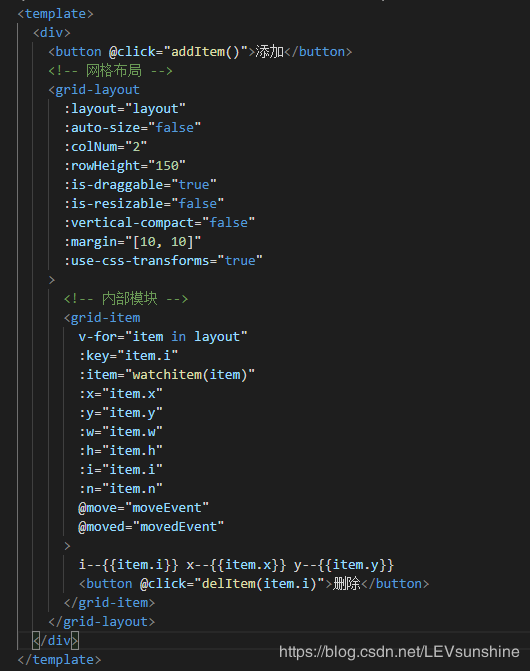

- 参数用法：

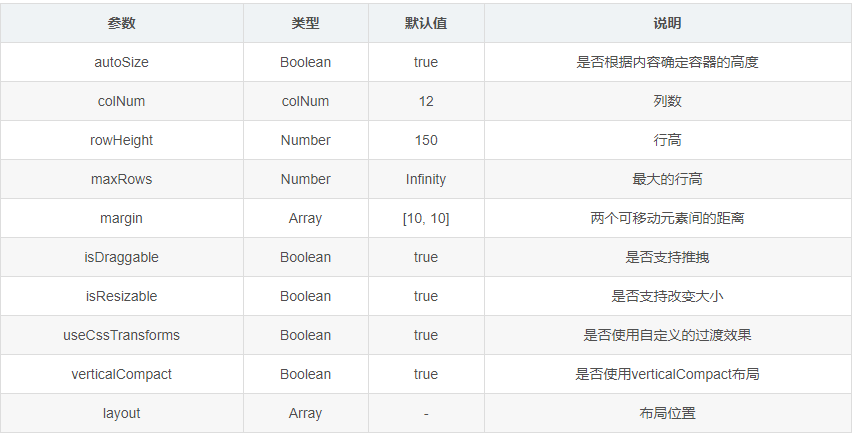

#### data数据格式

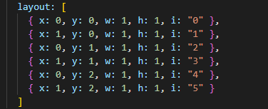

- 其中x、y分别定位元素位置（相当于坐标），w、h分别是模块的宽和高，i为唯一标识；xw即为元素 实际定位横坐标位置，yh为纵坐标位置。

#### 事件

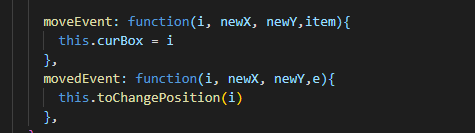

- moveEvent()移动事件，即鼠标按下时的事件；movedEvent()移动完成事件，鼠标抬起事件

- 这里需要注意用到一个监听函数（否则会出现拖拽模块时其他模块跟着移动）

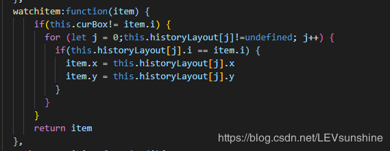

- 在data里声明一个和layout相同的数组，用来存储历史记录，当拖拽完成后，historyLayout数组才更新数据。

#### 交换算法

##### 我们要实现的是模块拖拽时目标元素占据当前元素位置，其之后的元素向后顺移，其之前的元素位置不变。

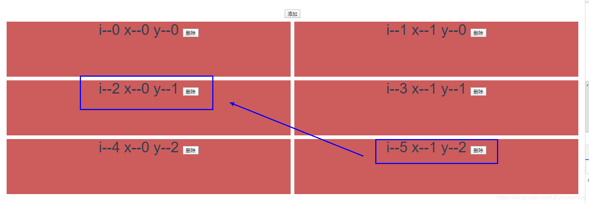


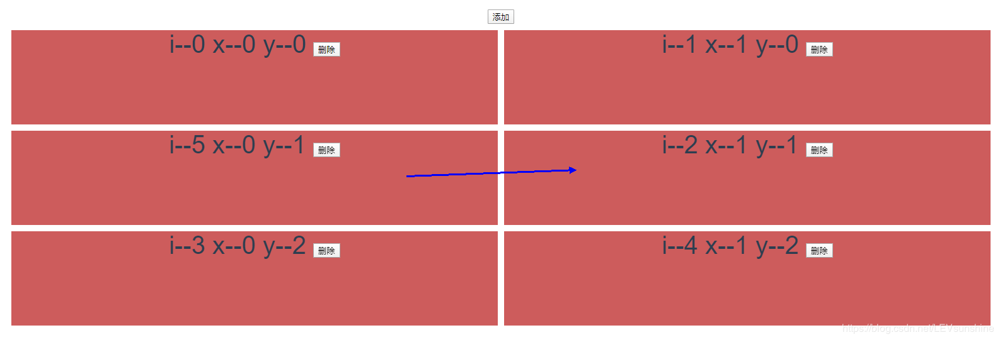

#### 如图将5移到2的位置，2，3，4向后移，0，1不变，从前向后换时，逻辑相反。

#### 算法代码

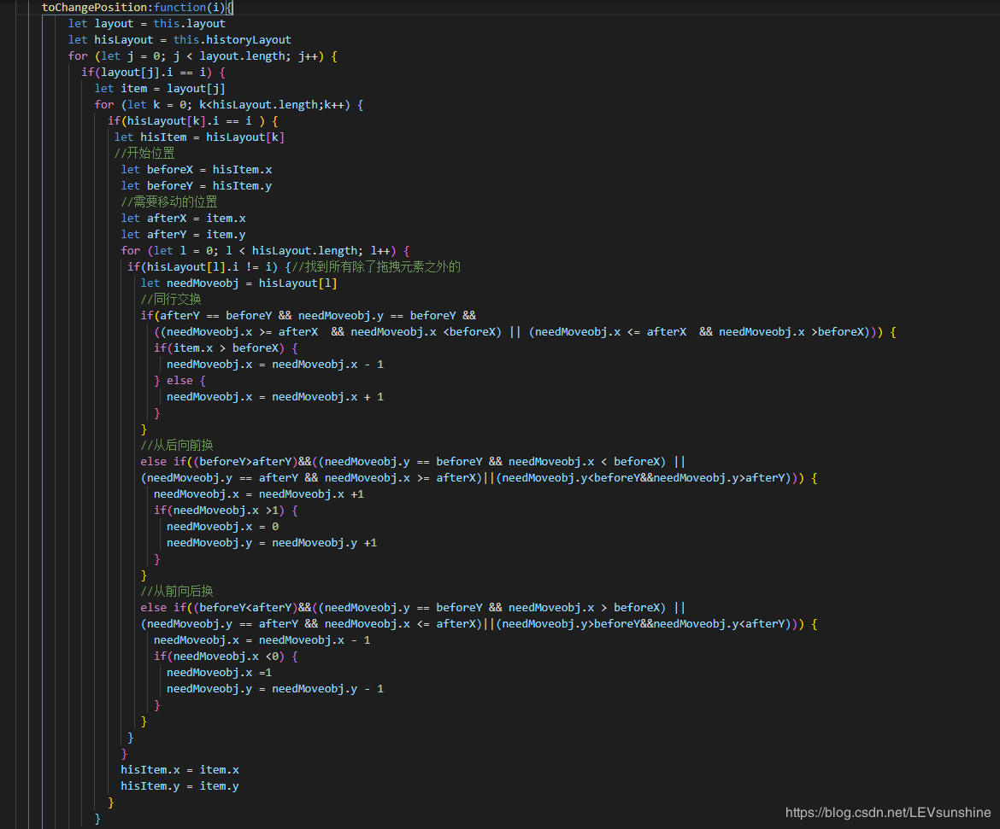

#### 当删除某一模块时，后面的模块向前顺移，同时删除数组中元素。

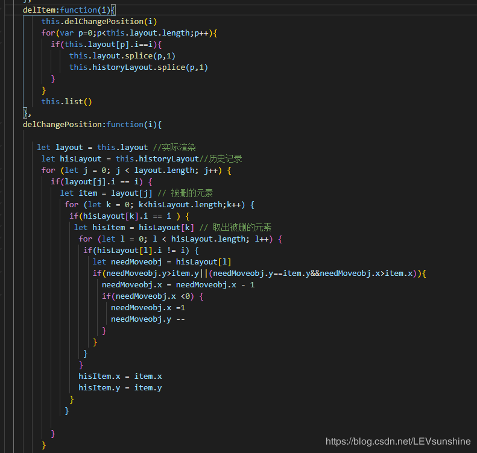

- 优势： 接口较多，可以实现更多的功能（如模块宽高自定义等），交互感受较好

- 劣势： 操纵X和Y坐标，交互算法复杂，加入删除后逻辑更复杂，如果每一模块宽高相等，建议使用下面的方法。

### awe-dnd

#### 既然使用vue就要发挥其巨大优势——数据操控，dom元素被数组渲染，因此只要改变数组中数据位置即可，删除和添加模块也只需要增删数组元素。

#### 页面效果：

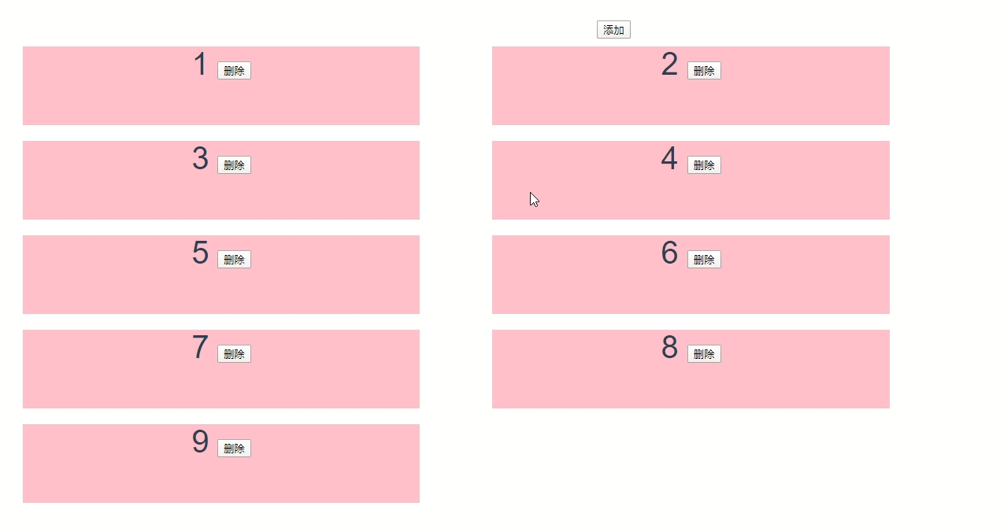

#### 实际项目样式：

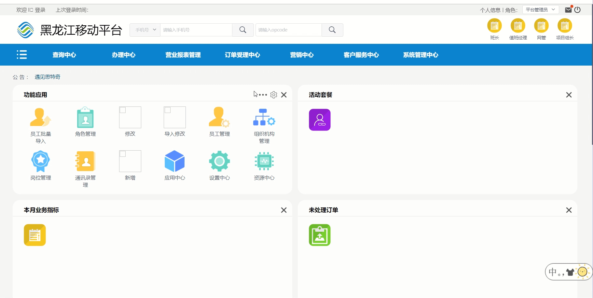

#### 页面有些丑，我们来看下代码实现：

- 安装： npm install awe-dnd --save

- 应用： 在main.js中引入（或当前页面局部引入）import VueDND from ‘awe-dnd’ Vue.use(VueDND)

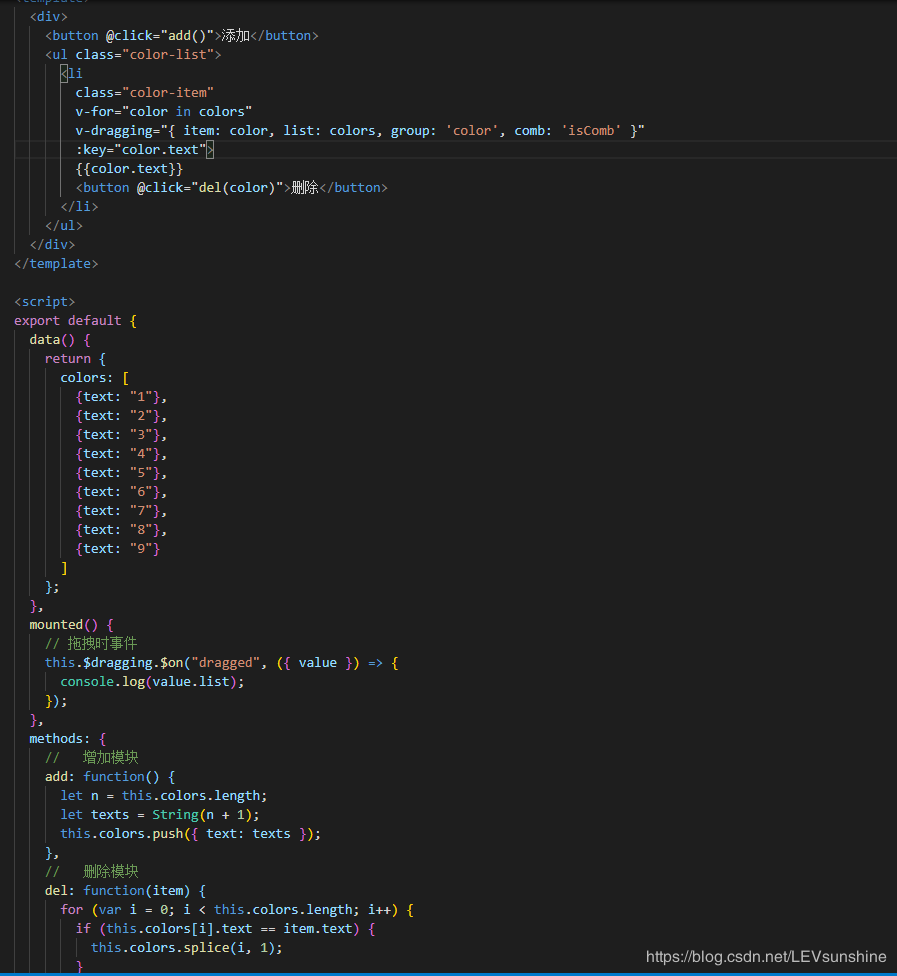

##### 加入删除和增加模块后也只有这些代码，非常轻便。

- **优势：**操纵数据顺序来改变元素位置，逻辑简单；

- **劣势：**只适用于模块大小相同的情况，无法实现完全的定制


### VUE实现拖拽功能

```
<template>
    <div class="error">
        <div id="lucky" 
        @mousedown="down" @touchstart="down"
        @mousemove="move" @touchmove="move"
        @mouseup="end" @touchend="end" @click="click"></div>
    </div>
</template>

<script>
export default {
    name: 'Error',
    data() {
        return {
            flags: false,
            position: { x: 0, y: 0 },
            nx: '',
            ny: '', 
            dx: '', 
            dy: '', 
            xPum: '', 
            yPum: '',
        }
    },
    methods: {
        // 实现移动端拖拽
        down(){
            var moveDiv = document.getElementById('lucky')
            this.flags = true;
            var touch;
            if(event.touches){
                touch = event.touches[0];
            }else {
                touch = event;
            }
            this.position.x = touch.clientX;
            this.position.y = touch.clientY;
            this.dx = moveDiv.offsetLeft;
            this.dy = moveDiv.offsetTop;
        },
        move(){
            var moveDiv = document.getElementById('lucky')
            if(this.flags){
            var touch ;
            if(event.touches){
                touch = event.touches[0];
            }else {
                touch = event;
            }
            this.nx = touch.clientX - this.position.x;
            this.ny = touch.clientY - this.position.y;
            this.xPum = this.dx+this.nx;
            this.yPum = this.dy+this.ny;
            moveDiv.style.left = this.xPum+"px";
            moveDiv.style.top = this.yPum +"px";
            //阻止页面的滑动默认事件；如果碰到滑动问题，1.2 请注意是否获取到 touchmove
                event.preventDefault();
            }
        },
        //鼠标释放时候的函数
        end(){
            this.flags = false;
            // 鼠标释放的时候从这里判断块是否被拖到窗口外变成负值，从而进行恢复
        },
        click() {
            console.log('click')
        }
    }
}
</script>

<style lang="scss" scoped>
.error {
    #lucky {
        width: 100px;
        height: 100px;
        background: red;
        position: fixed;
        top: 6rem;
        right: 0;
        z-index: 20070;
    }
}
</style>
```
