###公积金项目pc端问题总结
##### 1.解决表单样式被挤问题
**问题描述：** 随便打开一个公文表单，如果开始打开没有垂直滚动条，随着上传附件增多，出现垂直滚动条后，表单样式就出现问题了。 甚至有的表单恰好打开时，也会直接出现这种样式被挤的问题。
**解决：**
(1) 抽成一个公共的js，如：form-size.js
```js
function hasScrollbar() {
    var obj = document.getElementById('form_wyf'); // file-model.js里面有initSize()方法，但是那个方法有问题，由于这里form_wyf写死了，这个是项目里面的flow_handle.jsp里面的表单的id,所以就没放到file-model.js里面了，怕影响其他的项目
    return obj.scrollWidth > obj.clientWidth || obj.offsetWidth > obj.clientWidth
}

var bl = false;  //记录上次是否有滚动条，判断是否变化了，只有变化了才改变尺寸
function initSizeByScroll() {
    var ah = screen.availHeight;// 获取浏览器的屏幕的可用高度
    var aw = screen.availWidth;// 获取浏览器的屏幕的可用宽度
    self.resizeTo(aw, ah); // 初始打开最大化

    setInterval(function () {
        var flag = hasScrollbar();
        if(flag){
            if(!bl){
                ah = ah - 1;
                aw = aw - 1;
                bl = true;
                self.resizeTo(aw, ah);
            }

        }else{
            if(bl){
                ah = ah + 1;
                aw = aw + 1;
                bl = false;
                self.resizeTo(aw, ah);
            }
        }
    }, 500);
}

```
(2) 表单模板里面引用这个form-size.js并调用里面的方法 initSizeByScroll()
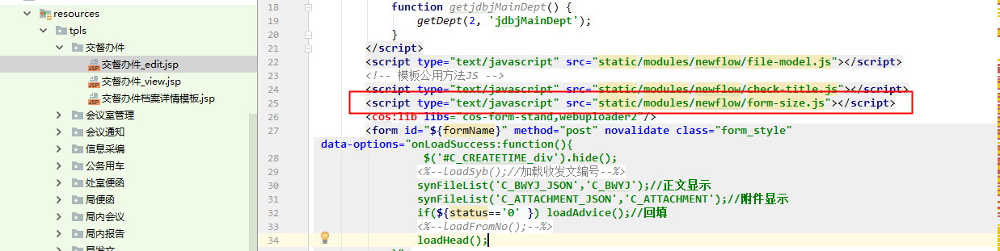
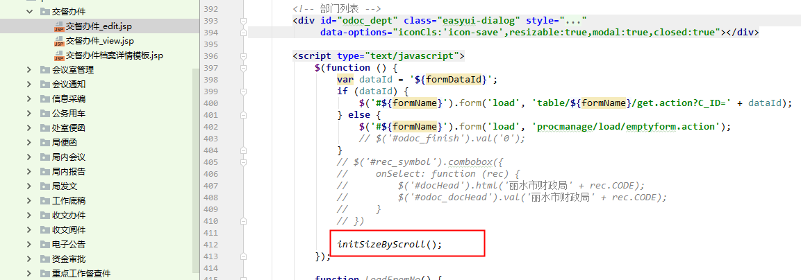

##### 2. c:if的多个条件写法注意
正确写法:
```js
<c:if test="${!allEdit || fn:contains(readonlys,'URGENT_LEVEL')}"></c:if>
```
错误写法: 
```js
<c:if test="${!allEdit } || ${fn:contains(readonlys,'URGENT_LEVEL')}"></c:if>
```


##### 3. C:if判断集合是否有值
```html
正确用法
<c:if test="${!empty accounts}">
```
```html
错误用法
<c:if test="${accounts.length > 0}">
```

##### 4. 文种里面自定义按钮命名规则
公文配置里面，如果有自定义按钮时，命名规则最好是以公文code为前缀，因为所有的自定义按钮的点击事件都写在flow_handle.jsp里面了，按这种规则之后不易混淆，便于区分。
如：xxcb_publish (信息采编里面的发布按钮)
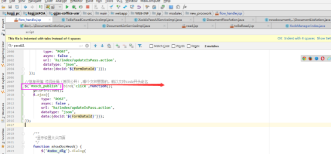

##### 5. 单选按钮、复选框选择时，点击后面的文字即可选中
**解决：** 在input外面包裹一个label标签即可
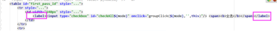

##### 6. 只读、必填控制统一写法
(1) 文本框的控制
```html
data-options="fit:true<c:choose>
                          <c:when test='${!allEdit}'>,readonly:true</c:when>
                          <c:when test='${allEdit }'>
                            <c:if test='${fn:contains(requireds,\'TITLE\')}'>,required:true</c:if>
                            <c:if test='${fn:contains(readonlys,\'TITLE\')}'>,readonly:true</c:if>
                          </c:when></c:choose>"
```
当data-options里面没有值时，可以主动添加一个
**data-options="fit:true 或者 data-options="deltaX:0**

deltaX:0代表偏移量为0，默认就是这个，所以不影响，但是可以达到data-options里面有值，这样拼接控制语句，就不容易出错了，就可以直接复制其他的过来，然后只要修改字段名即可

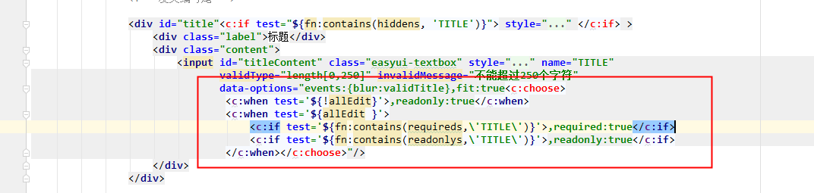

(2) 单选按钮控制
主要是必填的验证方式不一样,这里调用的是自定义的验证
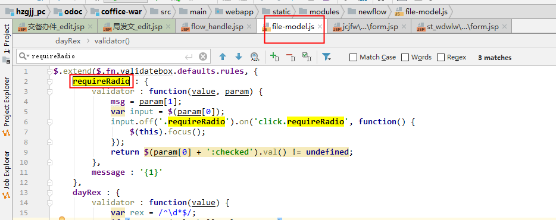
```html
data-options="deltaX:0<c:choose>
                          <c:when test='${!allEdit}'>,disabled:true</c:when>
                          <c:when test='${allEdit }'>
                            <c:if test='${fn:contains(requireds,\'PUBLISH\')}'>,validType:'requireRadio[\'input[name=PUBLISH]\',\'公开形式必填\']'</c:if>
                            <c:if test='${fn:contains(readonlys,\'PUBLISH\')}'>,disabled:true</c:if>
                          </c:when></c:choose>"
```
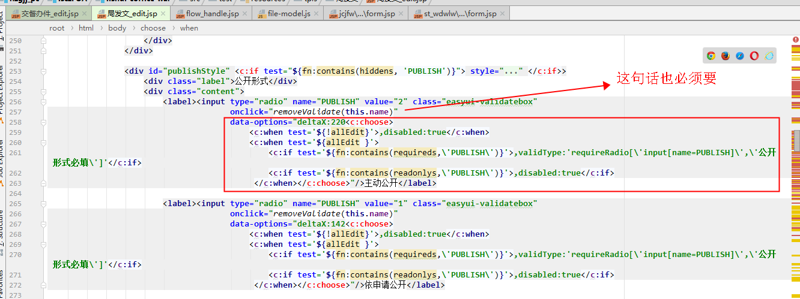
该标签上面还要有onclick="removeValidate(this.name)"。这句话的作用就是，当随便选了一个后，就将必填校验都去掉。如果没有这句，就会一直出现提示必填信息。
removeValidate这个方法在公共的file-model.js里面,因此只管调用即可

##### 7. 附件公共写法
```html
<c:if test="${isFileAttach }">
                    <div <c:if test="${fn:contains(hiddens, 'C_ATTACHMENT')}"> style="display:none;" </c:if>>
                        <div class="label">附件</div>
                        <div class="content">
                            <div align='right'>
                                <c:if test="${attachList.viewLog}">
                                    <a class="easyui-linkbutton" onclick="viewAttachViewLog('${formDataId}')">浏览日志</a>
                                </c:if>
                                <c:if test="${attachList.modifyLog}">
                                    <a class="easyui-linkbutton"
                                       onclick="viewAttachLog('${formDataId}','C_ATTACHMENT')">操作日志</a>
                                </c:if>
                            </div>

                            <c:if test="${!allEdit || fn:contains(readonlys,'C_ATTACHMENT')}">
                                <cos2:webuploader app="cos_soft"
                                                  name="C_ATTACHMENT"
                                                  id="C_ATTACHMENT"
                                                  text="C_ATTACHMENT_JSON"
                                                  nums="${attachList.fileCount}"
                                                  readonly="true"
                                                  size="${attachList.fileSize}"
                                                  suffix="${attachList.metaType}"
                                                  uploadSuccess="uploadCallBack"
                                                  filter="doFilter"/>
                            </c:if>
                            <c:if test="${allEdit && !fn:contains(readonlys,'C_ATTACHMENT')}">
                                <cos2:webuploader app="cos_soft"
                                                  name="C_ATTACHMENT"
                                                  id="C_ATTACHMENT"
                                                  text="C_ATTACHMENT_JSON"
                                                  nums="${attachList.fileCount}"
                                                  readonly="${!attachList.upload}"
                                                  size="${attachList.fileSize}"
                                                  suffix="${attachList.metaType}"
                                                  uploadSuccess="uploadCallBack"
                                                  filter="doFilter"/></c:if>
                        </div>
                    </div>
                </c:if>
```
##### 8. 在html里面传json对象字符串遇到空格报错问题
当js里面拼接html时，有时候需要传递对象参数，此时如果对象里面包含空格或者特殊字符（如：<>）时，就会出现问题。
**解决方式：** 通过编码解决
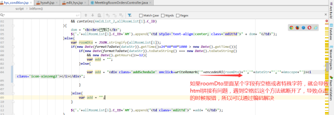
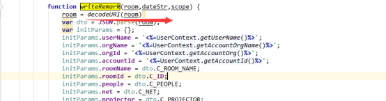

**编码与解码几种方式的区别**
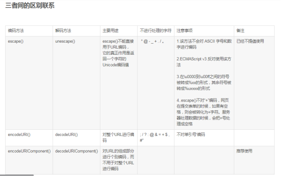

##### 9. Varchar2(100)与varchar2(100 char)的区别
Varchar2(100)      可以容纳100个英文字母，但是只能容纳50个汉字
Varchar2(100 char) 可以容纳100个汉字
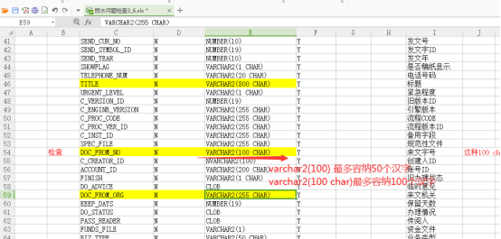

##### 10. 关于表单模版里面的phone或phone_v赋值
发现公积金项目里面的每个表单里面都有对phone和phone_v赋值的，这个是没有用的，可以去掉，如果碰到表单里面对电话号码要求展现的，才需要。
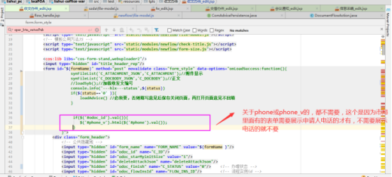

##### 11. C_CREATOR_ID 与 CREATOR 必须赋值
```html
 <input type="hidden" id="creatorId" name="C_CREATOR_ID" value="<%=UserContext.getAccountId()%>"/>
 <input type="hidden" id="creator" name="CREATOR" value='<%=UserContext.getUserName()%>'/>
```
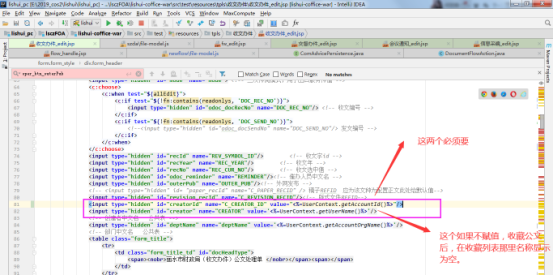

##### 12. C_STATUS初始状态为0
```html
<input type="hidden" id="odoc_finish" name="C_STATUS" value="0"/>
```
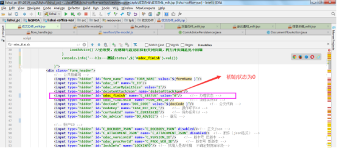
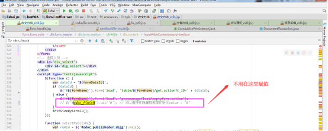

##### 13. IDEA里面部署的tomcat内存溢出
**-Xms256m -Xmx512m -XX:MaxNewSize=256m -XX:MaxPermSize=256m**
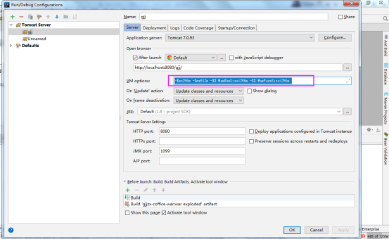

