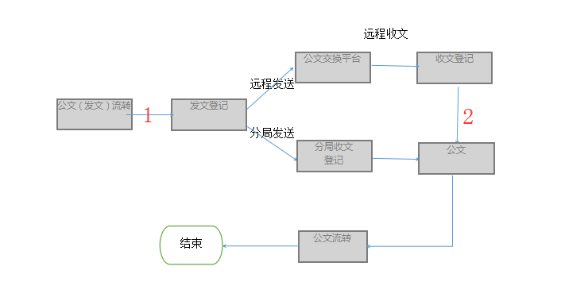
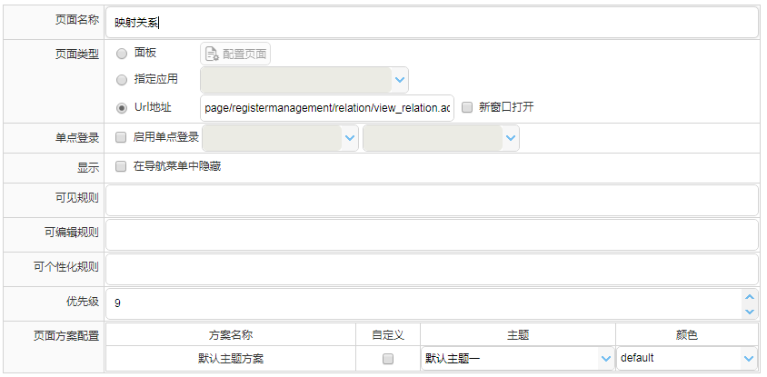
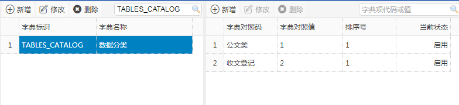
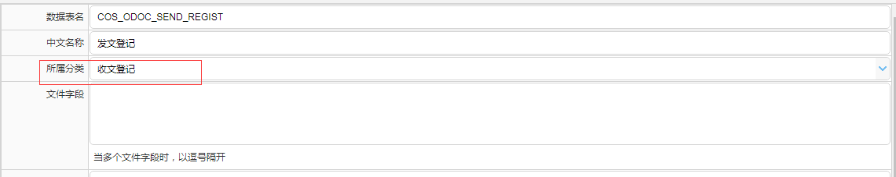
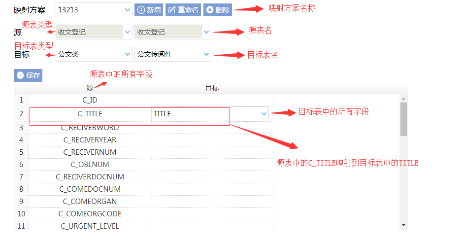

## 公文交换表结构映射关系操作手册
### 1.描述
> 表结构映射关系是用来维护公文转换时表之间字段映射关系，简单化映射条件，用户能够根据需求对不同表字段进行映射，以达到可控的映射关系。
在收发文登记中1：公文转发文登记，2：收文登记转公文都通过映射表字段实现，如图：

### 2.基础配置
#### 2.1菜单配置  
1.配置路径：门户管理 -- 站点管理 -- 页面管理  
2.菜单地址：  
映射关系：  page/registermanagement/relation/view_relation.action  
收文登记已办列表：  page/registermanagement/receive/done.action

配置如下：  

#### 2.2数据字典
新增key=TABLES_CATALOG，记录表所属分类，在【数据表管理】中注册表时使用

#### 2.3注册数据表
先维护2.2的数据字典中的表类型，然后在【数据表管理】中注册数据表，涉及到需要映射的表时需要填写“所属分类”项。

### 3.映射配置
#### 3.1图解

##### 1.映射方案  
①新建：在未选择映射方案时不允许其他操作。  
②重命名：修改映射方案名称  
③删除：在删除映射方案时会删除映射方案下的所有映射关系

##### 2.源  
①源表类型：取值范围为数据字典中的TABLES_CATALOG  
②源表名：【数据表管理】中选择表类型下关联的所有表名
在选择完源表名后，下面的列表中在【源】列中加载源表中的所有字段

##### 3.目标  
①目标表类型：取值范围为数据字典中的TABLES_CATALOG  
②目标表名：【数据表管理】中选择表类型下关联的所有表名
在选择完目标表后，下面的列表中在【目标】列会启用编辑，编辑状态下拉框的取值范围为目标表中的所有字段

##### 4.列表  
①源：源表中的所有字段  
②目标：点击行会启用行编辑状态，此列中的下拉框的取值范围为目标表中的所有字段

#### 3.2配置方式  
1.完成上述“基础设置”  
2.新增“映射方案”  
3.选择源表：选择表后列表会加载源表所有字段  
4.选择目标表：选择表后列表会启动编辑，下拉框为目标表字段  
5.设置对应关系：根据需求将源表与目标表中的字段进行匹配，目标表中的字段不能做重复映射  
6.保存映射关系  
7.再完成下面的“流程配置映射方案” 

#### 3.3 修改映射方案
选择映射方案，系统会根据设置自动加载数据
注意：
①在查看映射方案时源表数据不能修改
②在列表中选择目标列中下拉框的值时，会做以下几个验证
1.字段值是否被占用
2.选择字段是否在目标表字段范围内
若不能通过以上2个验证，不允许保存
③字段映射关系未做任何修改时不允许保存

### 4.流程配置映射方案
  
1.进入【流程管理】，选择对应的流程，进去流程基础设置  
2.【收、发文公文转换】-- 【启用交换】  
3.分别选择发文，收文对应的映射方案 
发文选择的方案应是“公文转发文登记”
收文选择的方案应是“收文登记转公文”